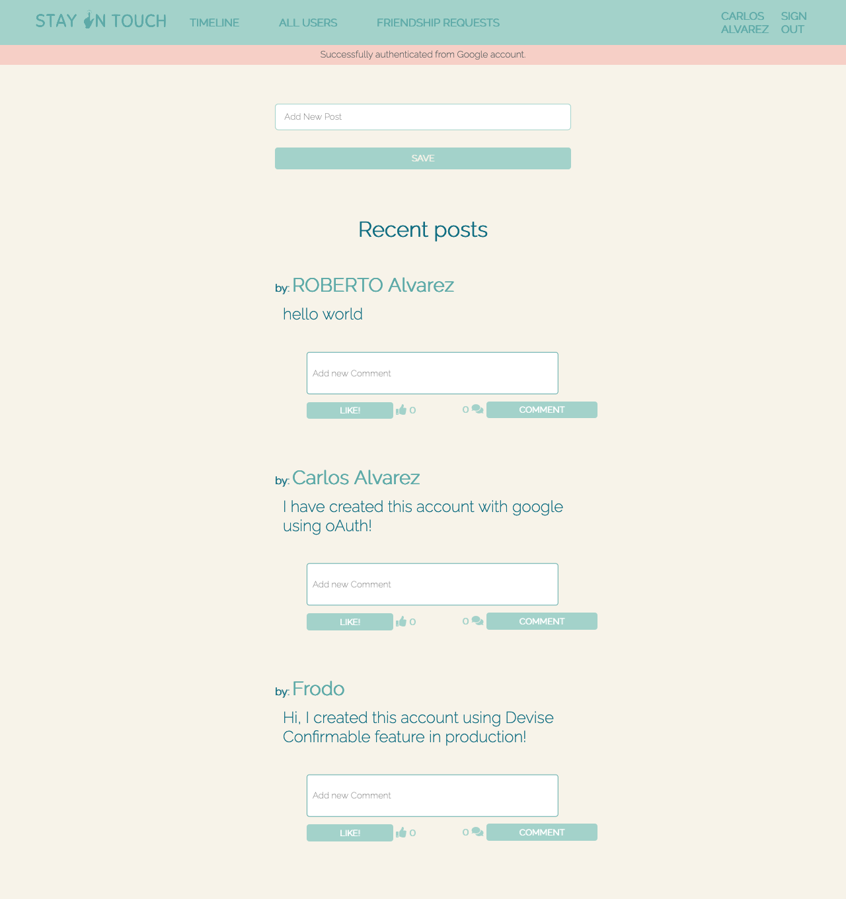
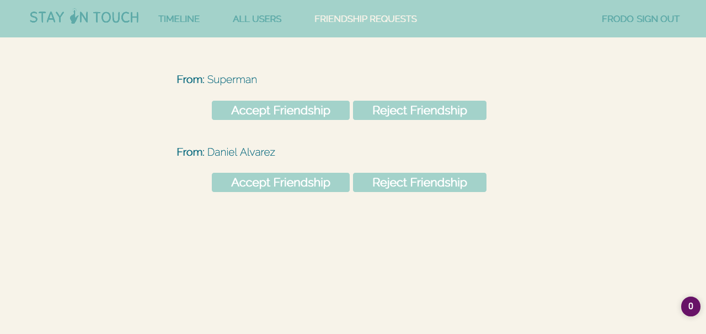

# Scaffold for social media app with Ruby on Rails

> This is a basic Social Media App (think Facebook) where users can befriend other users where the main objective was to build advanced model associations.

# About

> This is a social media app where you can create posts, add other users as friends, and make comments or like another post. The objective of this project was to build advanced associations in the database, implement scopes for faster queries, and create model methods for more efficient use of resources. Some additional features have been added to the project for learning purposes, such as sign up with a Google account, email confirmation, and welcome email messages.

What you can do on the app:
- Sign up and Log in
- Add other users as friends
- Accept or rejects friend requests
- See the status of your relationship with other users
- Create posts and see posts from your friends
- Users can comment and like on their friends' posts
- Authenticate username through API
- See posts, comments and create new comments through API

In this project we:
- Used PostgreSQL as the database
- Created advanced associations between users
- Used scopes to make more efficient database queries
- Created models, views, and controllers for users
- Used devise gem for user authentication, authorization, and email account confirmation
- Implemented ActionMailer to send a welcome mail to users who activate their account
- Implemented OAuth to allow users to sign up to the app using their Google account
- Implemented integration tests with Capybara
- Used Rspec to test model validations and associations
- Used JWT gem to build the API authentication flow

# Application Screenshot




## Built With

- Ruby v2.7.2
- Ruby on Rails v6.0.3.6
- OAuth
- JWT
- Google account services
- Devise gem for user registration and account confirmation
- Heroku
- PostgreSQL

## Live Demo

You can visit [here](https://fast-wildwood-38105.herokuapp.com) our app.

## Getting Started

To get a local copy up and running, follow these simple example steps:

- Clone this repository.
- Open the directory where you downloaded the repository.
- In your terminal, run the command `bundle install`. This command will install all the required dependencies.
- Afterwards, run the migrations. To do this, while in the project root folder, run the command: `rails db:migrate`.
- Run the command `yarn install --check-files` to install all the yarn dependencies of the project.

## Prerequisites

- Ruby v2.7.2
- Ruby on Rails v6.0.3.6
- Postgres: >=9.5

## Usage
### Heroku

- Open this [link](https://fast-wildwood-38105.herokuapp.com) in your browser

### Local

- Start the server with:

```
 rails server
```
- Open `http://localhost:3000/` in your browser

### Instructions

1. Create a user in 'Sign Up'
2. Check the tmp folder and open the newly created folder in it. Inside you will find a local copy of the confirmation mail sent to you
3. Open the plain.html or rich.html file in your preferred browser
4. Confirm your account by clicking on the link provided
5. Sign in to your new account with your account credentials
6. Post something
7. Add a friend in 'All Users'
8. Wait for a response
9. If your friend request is accepted, now you can see each other's posts

### API endpoints

The app allows a number of API calls using curl or your favorite API client, such as postman or VS Code's Thunder Client.
You must be logged in first to access protected content.

***Endpoints:***

#### /api/users
- Action: Register a new user.
- Method: POST
- Headers:
  - Accept: application/json
  - Content-Type: application/json
- Body: 
  ```json
  {
      "user": {
          "name": "api user 7", 
          "email": "apiuser7@email.com", 
          "password": "abc123",
          "password_confirmation": "abc123"
      }
  }
  ```
- Successful response:
    - status: 200 OK
    - body: 
      ```json
        { 
          success: true,
          response: 'Registration successful'
        }
      ```


#### /api/login
- Action: Login user.
- Method: POST
- Headers:
  - Accept: application/json
  - Content-Type: application/json
- Body:
  ```json
  {
    "api_user": {
      "email":"name@email.com",
      "password":"the password"
    }
  }
  ```
- Successful response:
    - status: 200 OK
    - body: jwt secret (Copy this to authenticate protected content access)

#### /posts.json
- Action: Get a list of posts.
- Method: GET
- Headers:
  - Accept: application/json
  - Content-Type: application/json
  - Authorization: Bearer **\<JWT TOKEN\>**
- Successful response:
  - status: 200 OK
  - body:
    ```json
      [
        {
          "id": 15,
          "user_id": 50,
          "content": "Hi, this is a nice post.",
          "created_at": "2021-10-07T16:45:18.580Z",
          "updated_at": "2021-10-07T16:45:18.580Z"
        },
        {
          "id": 14,
          "user_id": 51,
          "content": "Hello world.",
          "created_at": "2021-10-07T16:44:25.442Z",
          "updated_at": "2021-10-07T16:44:25.442Z"
        }
      ]

    ```

#### /posts/:post_id/comments.json
- Action: Get all comments from a post.
- Method: GET
- Headers:
  - Accept: application/json
  - Content-Type: application/json
  - Authorization: Bearer **\<JWT TOKEN\>**
- Successful response:
  - status: 200 OK
  - body:
    ```json
      [
        {
          "id": 15,
          "user_id": 51,
          "post_id": 15,
          "content": "This is a comment from API.",
          "created_at": "2021-10-07T16:46:52.875Z",
          "updated_at": "2021-10-07T16:46:52.875Z"
        }
      ]
    ```

#### /posts/:post_id/comments.json
- Action: Add a message on a post.
- Method: POST
- Headers:
  - Accept: application/json
  - Content-Type: application/json
  - Authorization: Bearer **\<JWT TOKEN\>**
- Body:
  ```json
    {
      "comment": {
        "content":"Your comment."
      }
    }
  ```
- Successful response:
  - status: 201 Created
  - body: `Message created successfully`
### Run tests

```
 rpsec --format documentation
```

There are two different types of tests in this project :

- Integration Tests made with Capybara (You will need a Chrome browser for these tests to work.)
- Unit Tests made with Rspec

## Authors

👤 **Alexisbec**
- Github: [@alexisbec](https://github.com/alexisbec)
- Linkedin: [Alexis Varela](www.linkedin.com/in/alexbec)
- Twitter : [@AlexisV31667779](https://twitter.com/AlexisV31667779)

👤 **Arturo Alvarez**
- Github: [@StarSheriff2](https://github.com/StarSheriff2)
- Twitter: [@ArturoAlvarezV](https://twitter.com/ArturoAlvarezV)
- Linkedin: [Arturo Alvarez](https://www.linkedin.com/in/arturoalvarezv/)

👤 **Eri**
- Github: [@errea](https://github.com/errea)
- Twitter: [@Erreakay](https://github.com/errea)
- Linkedin: [Eri Okereafor](https://www.linkedin.com/in/eri-ngozi-okereafor/)

👤 **Breno Xavier**
- Github: [@brenoxav](https://github.com/brenoxav)
- Linkedin: [Breno Xavier](https://www.linkedin.com/in/brenoxav/)

## 🤝 Contributing

Contributions, issues, and feature requests are welcome!

## Show your support

Give a ⭐️ if you like this project!

## 📝 License

This project is [MIT](https://github.com/alexisbec/ror-social-scaffold/blob/master/LICENSE) licensed.
